# **🌐 Web-Shop Projects**

## _Showcasing My Web Development Projects_


This repository contains a collection of projects built using **HTML5**, **CSS3**, and **JavaScript**.  
Each project showcases different web development concepts with a **modern, responsive, and user-friendly UI**.

- **🚀 Explore Projects** – Each project is self-contained and runs independently.  
- **📱 Responsive Design** – Optimized for mobile, tablet, and desktop devices.  
- **🎨 Sleek UI** – Dark mode aesthetic with smooth animations and intuitive interactions.  

---

## **🔗 Projects List**

### **🛠️ Core Projects**
#### **To-Do List**
[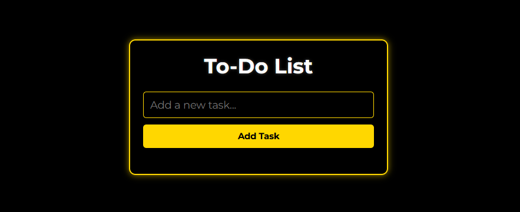](https://girish-kor.github.io/web-shop/pages/toDoList.html)  
🔗 **[Live Demo](https://girish-kor.github.io/web-shop/pages/toDoList.html)** | 📂 **[Repo](https://github.com/girish-kor/web-shop/blob/main/pages/toDoList.html)**  

#### **Calculator**
[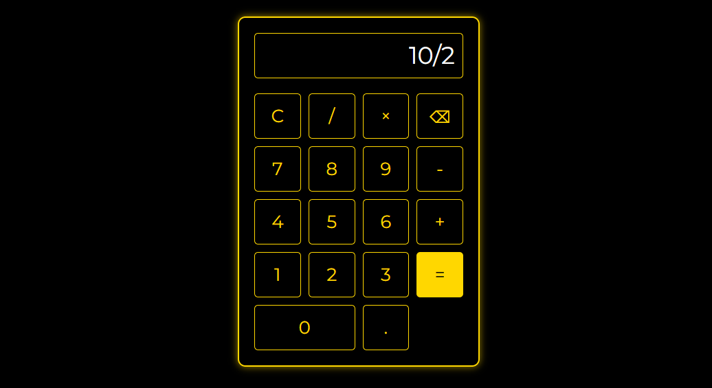](https://girish-kor.github.io/web-shop/pages/calculator.html)  
🔗 **[Live Demo](https://girish-kor.github.io/web-shop/pages/calculator.html)** | 📂 **[Repo](https://github.com/girish-kor/web-shop/blob/main/pages/calculator.html)**  

#### **Countdown Timer**
[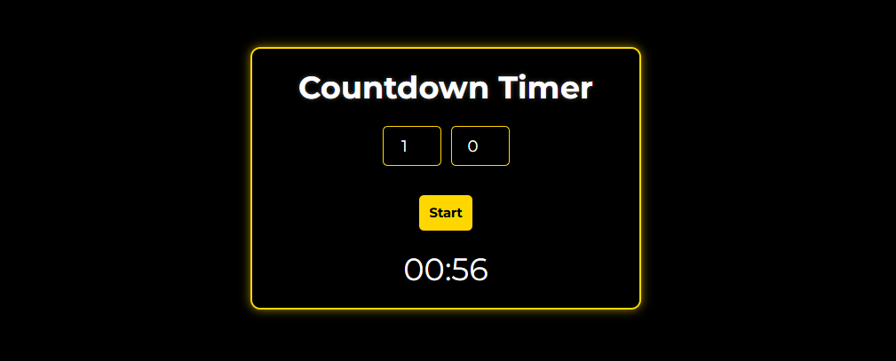](https://girish-kor.github.io/web-shop/pages/countdownTimer.html)  
🔗 **[Live Demo](https://girish-kor.github.io/web-shop/pages/countdownTimer.html)** | 📂 **[Repo](https://github.com/girish-kor/web-shop/blob/main/pages/countdownTimer.html)**  

---

### **🎨 UI/UX Focused Projects**
#### **Weather App**
[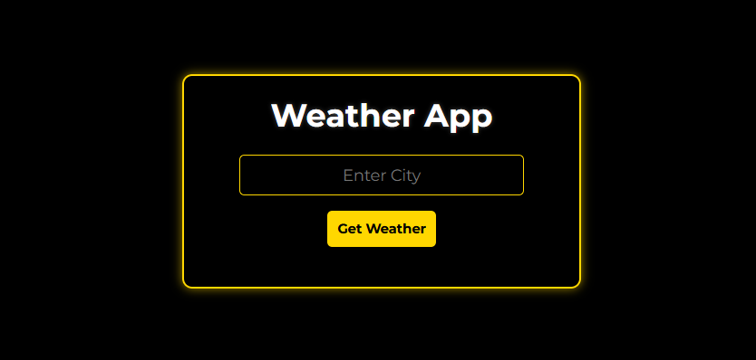](https://girish-kor.github.io/web-shop/pages/weatherApp.html)  
🔗 **[Live Demo](https://girish-kor.github.io/web-shop/pages/weatherApp.html)** | 📂 **[Repo](https://github.com/girish-kor/web-shop/blob/main/pages/weatherApp.html)**  

#### **Drawing Canvas**
[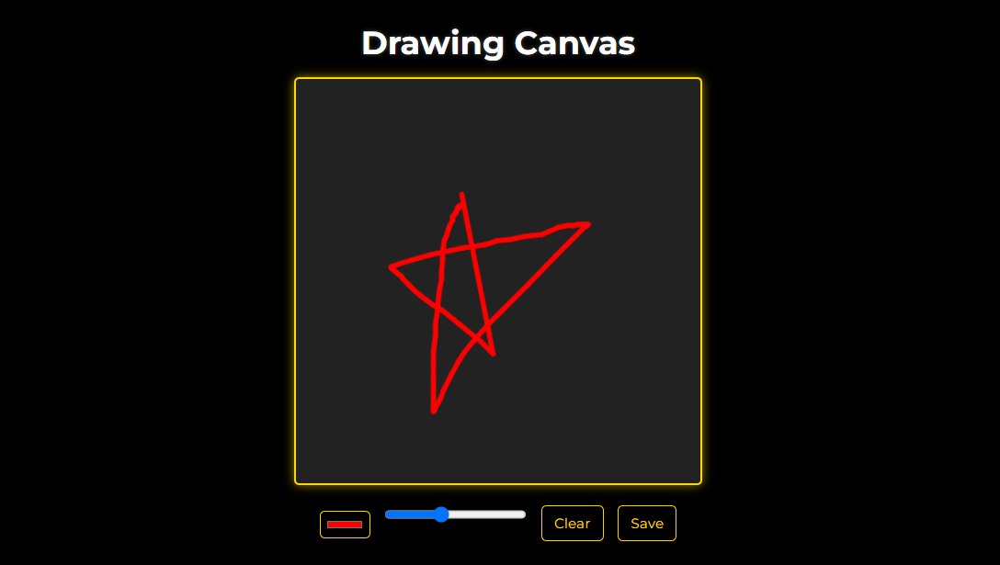](https://girish-kor.github.io/web-shop/pages/drawingCanvas.html)  
🔗 **[Live Demo](https://girish-kor.github.io/web-shop/pages/drawingCanvas.html)** | 📂 **[Repo](https://github.com/girish-kor/web-shop/blob/main/pages/drawingCanvas.html)**  

#### **Color Palette Generator**
[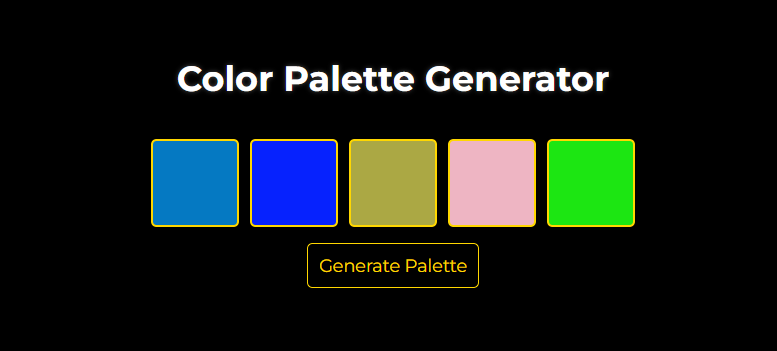](https://girish-kor.github.io/web-shop/pages/colorPalette.html)  
🔗 **[Live Demo](https://girish-kor.github.io/web-shop/pages/colorPalette.html)** | 📂 **[Repo](https://github.com/girish-kor/web-shop/blob/main/pages/colorPalette.html)**  

---

### **📌 Utility & Productivity Apps**
#### **Recipe Finder**
[](https://girish-kor.github.io/web-shop/pages/recipeFinder.html)  
🔗 **[Live Demo](https://girish-kor.github.io/web-shop/pages/recipeFinder.html)** | 📂 **[Repo](https://github.com/girish-kor/web-shop/blob/main/pages/recipeFinder.html)**  

#### **Note-Taking App**
[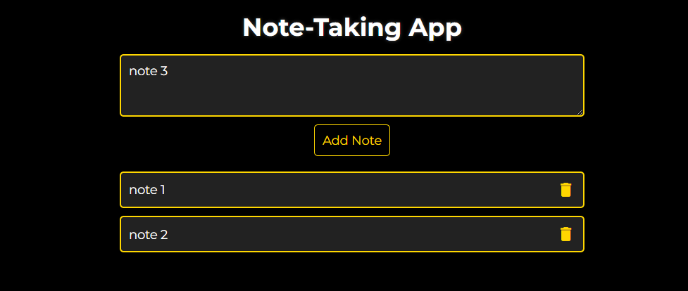](https://girish-kor.github.io/web-shop/pages/noteTaking.html)  
🔗 **[Live Demo](https://girish-kor.github.io/web-shop/pages/noteTaking.html)** | 📂 **[Repo](https://github.com/girish-kor/web-shop/blob/main/pages/noteTaking.html)**  

#### **Budget Tracker**
[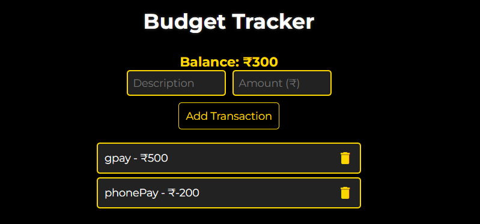](https://girish-kor.github.io/web-shop/pages/budgetTracker.html)  
🔗 **[Live Demo](https://girish-kor.github.io/web-shop/pages/budgetTracker.html)** | 📂 **[Repo](https://github.com/girish-kor/web-shop/blob/main/pages/budgetTracker.html)**  

---

### **🕹️ Additional Projects**
#### **Blog Layout**
[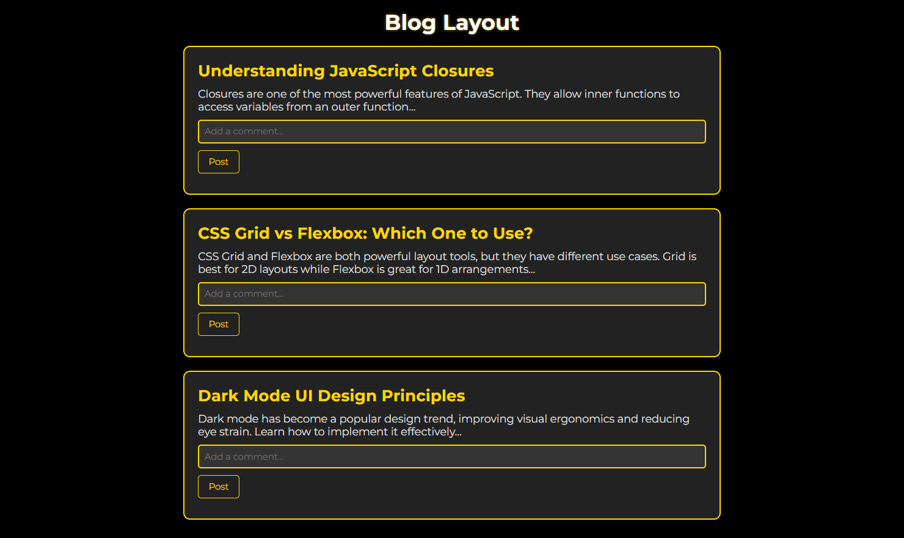](https://girish-kor.github.io/web-shop/pages/blogLayout.html)  
🔗 **[Live Demo](https://girish-kor.github.io/web-shop/pages/blogLayout.html)** | 📂 **[Repo](https://github.com/girish-kor/web-shop/blob/main/pages/blogLayout.html)**  

#### **BMI Calculator**
[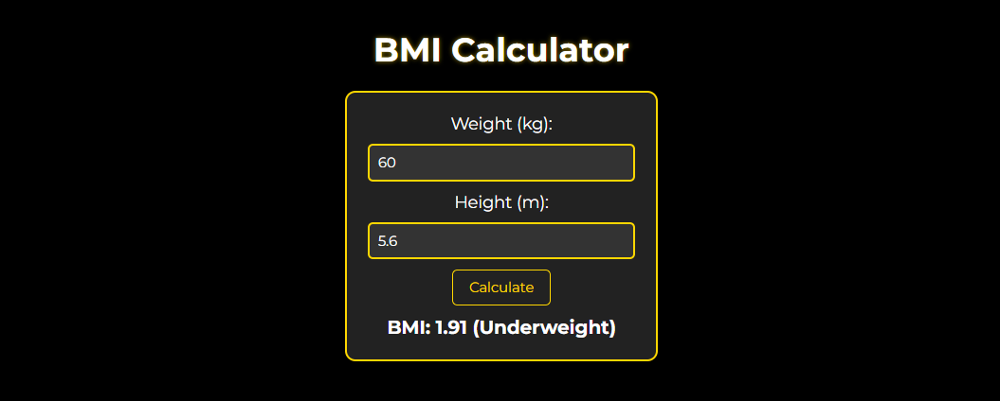](https://girish-kor.github.io/web-shop/pages/bmiCalculator.html)  
🔗 **[Live Demo](https://girish-kor.github.io/web-shop/pages/bmiCalculator.html)** | 📂 **[Repo](https://github.com/girish-kor/web-shop/blob/main/pages/bmiCalculator.html)**  

#### **Age Calculator**
[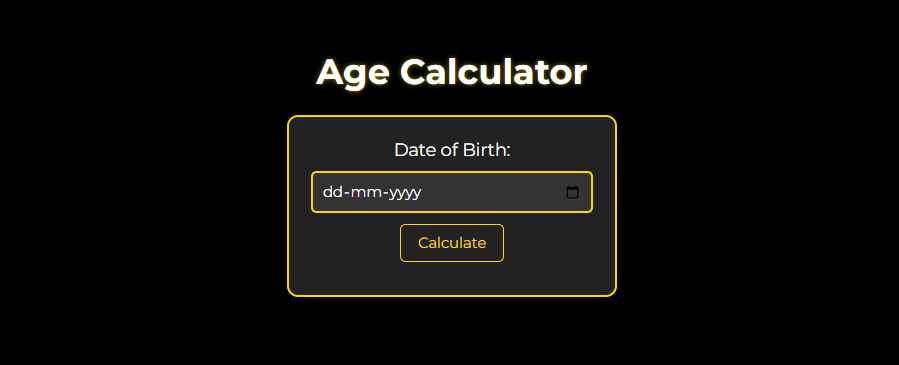](https://girish-kor.github.io/web-shop/pages/ageCalculator.html)  
🔗 **[Live Demo](https://girish-kor.github.io/web-shop/pages/ageCalculator.html)** | 📂 **[Repo](https://github.com/girish-kor/web-shop/blob/main/pages/ageCalculator.html)**  

---

## **📌 Key Features**
✔ **Modern Dark Mode UI**  
✔ **Fully Responsive Design**  
✔ **Smooth Animations & Transitions**  
✔ **Real-Time API Integration**  
✔ **LocalStorage for Data Persistence**  

---

## **📂 Getting Started**
Clone the repository and run locally:

```bash
git clone https://github.com/girish-kor/web-shop.git
cd web-shop
