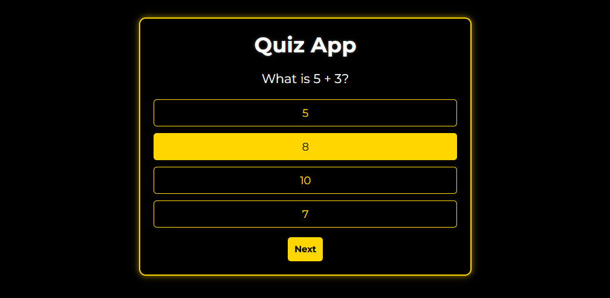
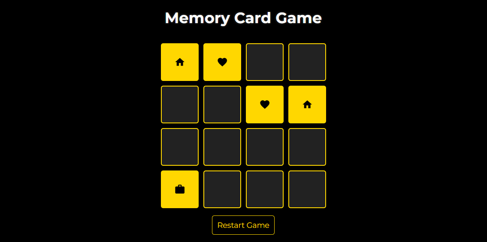
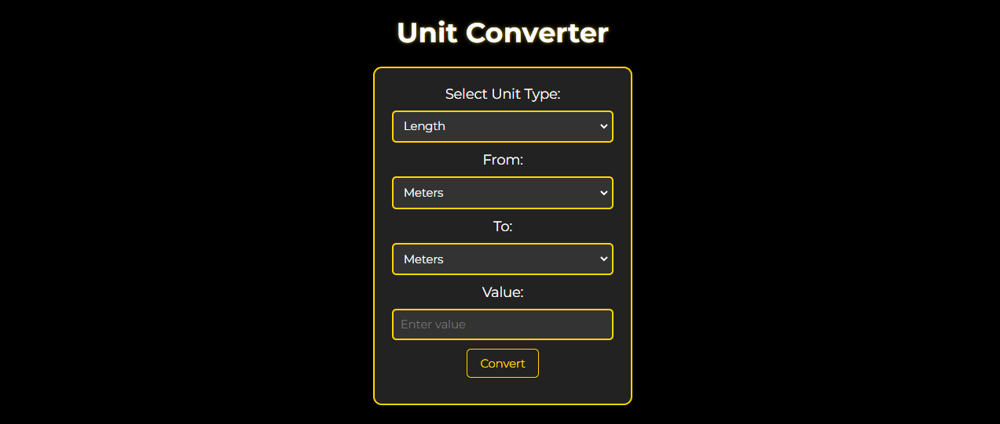
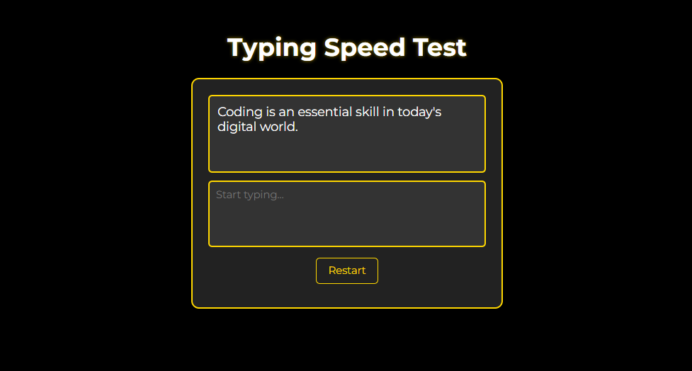
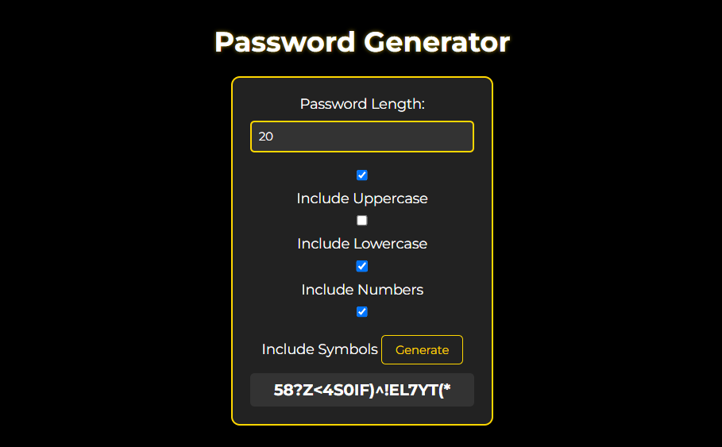
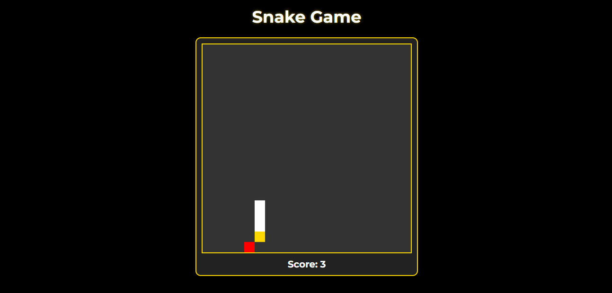

# **Web-Shop** 🛒

## _Showcasing My Web Development Projects_

This repository contains a collection of **20 fully functional web-based projects** built using **HTML5**, **CSS3**, and **JavaScript**. These projects showcase modern UI/UX designs, interactive features, and fully responsive layouts.

## **🌟 Key Features**
- **Modern Aesthetic** – Sleek, dark-mode UI with smooth animations.
- **Fully Responsive** – Optimized for mobile, tablet, and desktop devices.
- **Interactive UI** – Hover effects, transitions, and animations.
- **API Integration** – Real-time data fetching for enhanced functionality.
- **LocalStorage Support** – Persistent data for user interactions.
- **Glassmorphism & Neumorphism** – Stylish UI elements for a premium feel.

---

## **📌 Projects List**
### **🚀 Core Web Applications**
1. **[To-Do List](./projects/pages/toDoList.html)**
   Task manager with drag & drop, prioritization, and reminders.  
     
   [Live Preview](https://github.com/girish-kor/toDoList)

2. **[Calculator](./projects/pages/calculator.html)**
   Scientific calculator with history log and clipboard copy.  
     
   [Live Preview](https://github.com/girish-kor/calculator)

3. **[Countdown Timer](./projects/pages/countdownTimer.html)**
   Multi-timer with Pomodoro mode and custom alarms.  
     
   [Live Preview](https://github.com/girish-kor/countdownTimer)

4. **[Quiz App](./projects/pages/quizApp.html)**
   Timed quiz with randomized questions and leaderboard.  
     
   [Live Preview](https://github.com/girish-kor/quizApp)

---

### **🎨 UI/UX Focused Projects**
5. **[Weather App](./projects/pages/weatherApp.html)**
   Real-time weather updates with smooth UI.  
     
   [Live Preview](https://github.com/girish-kor/weatherApp)

6. **[Drawing Canvas](./projects/pages/drawingCanvas.html)**
   Brush tools, layers, and export functionality.  
     
   [Live Preview](https://github.com/girish-kor/drawingCanvas)

7. **[Color Palette Generator](./projects/pages/colorPalette.html)**
   Generate complementary color palettes from images.  
     
   [Live Preview](https://github.com/girish-kor/colorPalette)

8. **[Memory Card Game](./projects/pages/memoryGame.html)**
   Fun memory matching game with score tracking.  
     
   [Live Preview](https://github.com/girish-kor/memoryGame)

---

### **📋 Productivity & Utility Apps**
9. **[Recipe Finder](./projects/pages/recipeFinder.html)**
   Search and save recipes based on ingredients.  
     
   [Live Preview](https://github.com/girish-kor/recipeFinder)

10. **[Note-Taking App](./projects/pages/noteTaking.html)**
    Markdown-based note manager with folders.  
      
    [Live Preview](https://github.com/girish-kor/noteTaking)

11. **[Budget Tracker](./projects/pages/budgetTracker.html)**
    Manage expenses with graphs and currency conversion.  
      
    [Live Preview](https://github.com/girish-kor/budgetTracker)

12. **[Music Player](./projects/pages/musicPlayer.html)**
    Playlists, equalizer, and lyrics display.  
      
    [Live Preview](https://github.com/girish-kor/musicPlayer)

---

### **📚 Additional Projects**
13. **[Blog Layout](./projects/pages/blogLayout.html)**
    Blog with commenting, search, and filtering.  
      
    [Live Preview](https://github.com/girish-kor/blogLayout)

14. **[BMI Calculator](./projects/pages/bmiCalculator.html)**
    Calculate BMI with graphical health analysis.  
      
    [Live Preview](https://github.com/girish-kor/bmiCalculator)

15. **[Age Calculator](./projects/pages/ageCalculator.html)**
    Calculate age with zodiac signs and birthday countdown.  
      
    [Live Preview](https://github.com/girish-kor/ageCalculator)

16. **[Unit Converter](./projects/pages/unitConverter.html)**
    Convert measurements and currency in real-time.  
      
    [Live Preview](https://github.com/girish-kor/unitConverter)

17. **[Typing Speed Test](./projects/pages/typingSpeedTest.html)**
    Measure typing speed with error tracking.  
      
    [Live Preview](https://github.com/girish-kor/typingSpeedTest)

18. **[Password Generator](./projects/pages/passwordGenerator.html)**
    Generate secure passwords with complexity settings.  
      
    [Live Preview](https://github.com/girish-kor/passwordGenerator)

19. **[Snake Game](./projects/pages/snakeGame.html)**
    Classic Snake game with multiple difficulty levels.  
      
    [Live Preview](https://github.com/girish-kor/snakeGame)

---

## **📂 Project Structure**
