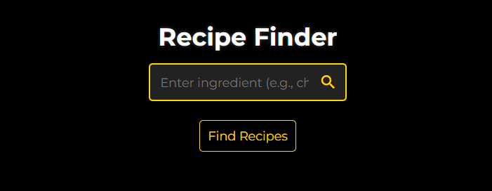

# **Web-Shop**

## _Showcasing My Web Development Projects_

[](https://github.com/girish-kor)

🔗 **Live Demo:** [Web-Shop](https://web-shop-hu5w.onrender.com)

This repository contains a collection of projects built using **HTML5**, **CSS3**, and **JavaScript**. These projects reflect my passion for coding and demonstrate a variety of web development concepts with a modern, user-friendly, and responsive design.

- **Explore Projects**: Each project is self-contained and can be run independently in your browser.
- **Responsive Design**: Projects are fully responsive and optimized for mobile, tablet, and desktop devices.
- **Sleek Design**: Modern, dark mode aesthetic with smooth animations and intuitive user interactions.

---

## **Projects List**

### **Core Projects**

1. **[To-Do List](https://web-shop-hu5w.onrender.com/projects/pages/toDoList.html)**
   A task manager with drag & drop, prioritization, reminders, and voice input.  
     
   [Live Preview](https://web-shop-hu5w.onrender.com/projects/pages/toDoList.html)

2. **[Calculator](https://web-shop-hu5w.onrender.com/projects/pages/calculator.html)**
   A scientific calculator with history log and clipboard copy.  
     
   [Live Preview](https://web-shop-hu5w.onrender.com/projects/pages/calculator.html)

3. **[Countdown Timer](https://web-shop-hu5w.onrender.com/projects/pages/countdownTimer.html)**
   A multi-timer application with Pomodoro mode and custom alarms.  
     
   [Live Preview](https://web-shop-hu5w.onrender.com/projects/pages/countdownTimer.html)

4. **[Quiz App](https://web-shop-hu5w.onrender.com/projects/pages/quizApp.html)**
   A timed quiz app with randomized questions and a leaderboard.  
     
   [Live Preview](https://web-shop-hu5w.onrender.com/projects/pages/quizApp.html)

---

### **UI/UX Focused Projects**

5. **[Weather App](https://web-shop-hu5w.onrender.com/projects/pages/weatherApp.html)**
   A weather application fetching real-time weather data with a smooth interface.  
     
   [Live Preview](https://web-shop-hu5w.onrender.com/projects/pages/weatherApp.html)

6. **[Drawing Canvas](https://web-shop-hu5w.onrender.com/projects/pages/drawingCanvas.html)**
   A drawing platform featuring brushes, layers, and export options.  
     
   [Live Preview](https://web-shop-hu5w.onrender.com/projects/pages/drawingCanvas.html)

7. **[Color Palette Generator](https://web-shop-hu5w.onrender.com/projects/pages/colorPalette.html)**
   A tool to generate complementary color palettes from images.  
     
   [Live Preview](https://web-shop-hu5w.onrender.com/projects/pages/colorPalette.html)

8. **[Memory Card Game](https://web-shop-hu5w.onrender.com/projects/pages/memoryGame.html)**
   A memory matching game with different difficulty levels and a score leaderboard.  
     
   [Live Preview](https://web-shop-hu5w.onrender.com/projects/pages/memoryGame.html)

---

### **Utility & Productivity Apps**

9. **[Recipe Finder](https://web-shop-hu5w.onrender.com/projects/pages/recipeFinder.html)**
   A recipe search application that finds recipes based on ingredients.  
     
   [Live Preview](https://web-shop-hu5w.onrender.com/projects/pages/recipeFinder.html)

10. **[Note-Taking App](https://web-shop-hu5w.onrender.com/projects/pages/noteTaking.html)**
    A feature-rich note-taking app with Markdown support and text-to-speech functionality.  
      
    [Live Preview](https://web-shop-hu5w.onrender.com/projects/pages/noteTaking.html)

11. **[Budget Tracker](https://web-shop-hu5w.onrender.com/projects/pages/budgetTracker.html)**
    A tool to manage expenses, track budgets, and convert currencies.  
      
    [Live Preview](https://web-shop-hu5w.onrender.com/projects/pages/budgetTracker.html)

12. **[Music Player](https://web-shop-hu5w.onrender.com/projects/pages/musicPlayer.html)**
    A music player that supports playlists, volume control, and equalizer.  
      
    [Live Preview](https://web-shop-hu5w.onrender.com/projects/pages/musicPlayer.html)

---

### **Additional Projects**

13. **[Blog Layout](https://web-shop-hu5w.onrender.com/projects/pages/blogLayout.html)**
    A customizable blog layout with a commenting and filtering system.  
      
    [Live Preview](https://web-shop-hu5w.onrender.com/projects/pages/blogLayout.html)

14. **[BMI Calculator](https://web-shop-hu5w.onrender.com/projects/pages/bmiCalculator.html)**
    A Body Mass Index calculator with health recommendations.  
      
    [Live Preview](https://web-shop-hu5w.onrender.com/projects/pages/bmiCalculator.html)

15. **[Age Calculator](https://web-shop-hu5w.onrender.com/projects/pages/ageCalculator.html)**
    An age calculator that provides zodiac signs and next birthday countdown.  
      
    [Live Preview](https://web-shop-hu5w.onrender.com/projects/pages/ageCalculator.html)

16. **[Unit Converter](https://web-shop-hu5w.onrender.com/projects/pages/unitConverter.html)**
    A multi-unit converter supporting different measurement systems.  
      
    [Live Preview](https://web-shop-hu5w.onrender.com/projects/pages/unitConverter.html)

17. **[Typing Speed Test](https://web-shop-hu5w.onrender.com/projects/pages/typingSpeedTest.html)**
    A typing speed test with error highlighting and a leaderboard.  
      
    [Live Preview](https://web-shop-hu5w.onrender.com/projects/pages/typingSpeedTest.html)

18. **[Password Generator](https://web-shop-hu5w.onrender.com/projects/pages/passwordGenerator.html)**
    A secure password generator with customizable length and complexity.  
      
    [Live Preview](https://web-shop-hu5w.onrender.com/projects/pages/passwordGenerator.html)

19. **[Snake Game](https://web-shop-hu5w.onrender.com/projects/pages/snakeGame.html)**
    The classic Snake game with multiple difficulty levels.  
      
    [Live Preview](https://web-shop-hu5w.onrender.com/projects/pages/snakeGame.html)

---

## **Key Features**
- **Modern Aesthetic**: All projects use dark mode designs with sleek animations.
- **Fully Responsive**: Optimized for all devices (mobile, tablet, desktop).
- **Smooth Animations**: Hover effects and interactive transitions enhance user experience.
- **Real-Time Data**: Many projects use real-time data via APIs for dynamic functionality.
- **LocalStorage Support**: Persistent data storage for tasks like to-do lists and budget tracking.

---

## **Getting Started**
Clone the repository:
```bash
git clone https://github.com/girish-kor/Web-Shop.git
